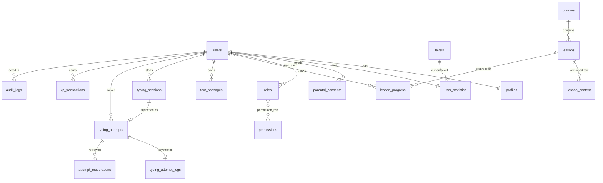

# Database ERD

Tables that exist today are in the first diagram; the full target model is in the Phase 1 proposal.

```mermaid
erDiagram
  users ||--|| profiles : has
  users ||--|| user_statistics : has
  users ||--o{ parental_consents : needs
  users }o--o{ roles : role_user
  roles }o--o{ permissions : permission_role
  levels ||--o{ user_statistics : "current level"

  courses ||--o{ lessons : contains
  lessons ||--o{ lesson_content : "versioned text"
  users ||--o{ lesson_progress : tracks
  lessons ||--o{ lesson_progress : "progress on"
  users ||--o{ text_passages : owns

  users ||--o{ typing_sessions : starts
  typing_sessions ||--o| typing_attempts : "submitted as"
  typing_attempts ||--o| typing_attempt_logs : keystrokes
  typing_attempts ||--o{ attempt_moderations : reviewed
  users ||--o{ typing_attempts : makes
  users ||--o{ xp_transactions : earns
  users ||--o{ audit_logs : "acted in"
```
